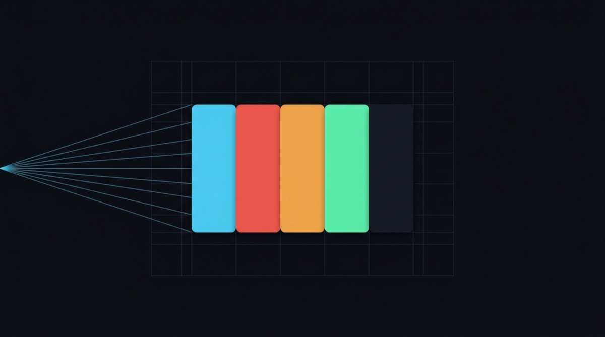

<div align="center">



# Palette Forge

**Give it a picture. Get the colours, and the code to use them.**

[Live tool](https://paletteforge.dev) · [npm package](https://www.npmjs.com/package/palette-forge) · [Docs](./docs/)

</div>

---

Point it at a logo or a screenshot. It finds the main colours, works out which one is your
brand colour and which is your text colour, checks that they're readable together, and
writes the CSS for you.

```bash
npx palette-forge logo.png
```

Nothing to install, no account, no upload.

> **New here?** → **[Getting started](./docs/getting-started.md)** explains it with no jargon.
> Unfamiliar word? → **[Glossary](./docs/glossary.md)**.

**Under the hood, for those who care:** OKLab k-means quantisation · WCAG 2.1 contrast
scoring · OKLCH tonal ramps · nine token formats.

---

## What's in here

| | |
|---|---|
| [`packages/palette-forge`](./packages/palette-forge) | The engine, published to npm. Zero dependencies on the browser path, ~11.6 KB gzipped. Ships a core API, React hooks, Node decoders and a CLI. |
| [`apps/web`](./apps/web) | The Next.js 16 app at paletteforge.dev. Drop an image, tune the extraction, copy the tokens. Extraction runs entirely client-side. |
| [`docs`](./docs) | Getting started, glossary, API reference, CLI guide, recipes, publishing notes. |
| [`marketing`](./marketing) | Launch kit: copy, positioning, calendar, asset briefs. |
| [`assets`](./assets) | Brand imagery. See [`assets/README.md`](./assets/README.md). |

## Quick start

```bash
# Try it without installing
npx palette-forge logo.png

# Use it in a project
npm install palette-forge
```

```ts
import { extractPaletteFromImage, toShadcn } from "palette-forge";

const palette = await extractPaletteFromImage(file);
palette.swatches[0];   // { hex: "#4cc9f0", role: "primary", share: 0.34, … }
toShadcn(palette);     // a complete light + dark theme, contrast-repaired to AA
```

Full package documentation: **[packages/palette-forge/README.md](./packages/palette-forge/README.md)**

## Develop

```bash
pnpm install
pnpm --filter palette-forge build   # build the package first, the app consumes it
pnpm dev                            # start the web app on :3000
pnpm test                           # 101 tests
pnpm typecheck
```

The web app imports `palette-forge` as a workspace dependency, so the package must be built
at least once before the app will resolve it.

```bash
# The app's own light and dark themes, checked with the app's own library
node apps/web/scripts/check-contrast.mjs
```

## Design decisions worth knowing

**Clustering happens in OKLab, not RGB.** Euclidean distance in RGB does not match how
people see colour, which is why simpler extractors hand back three near-identical blues and
miss the accent entirely.

**Clusters snap to a real colour.** Each cluster resolves to its medoid, a colour that
genuinely occurs in the image, rather than the arithmetic mean of its members. Drop a flat
logo and you get its exact brand hex back.

**Extraction is deterministic.** k-means++ seeding runs off a seeded PRNG. The same image
and options always produce the same palette, so results can be cached, diffed and asserted
against in tests. Pass a different `seed` when you want a different take.

**Identical colours are deduplicated before clustering.** Flat-colour art collapses from
tens of thousands of pixels to a few hundred weighted unique colours. That is
mathematically identical and an order of magnitude faster. Typical extraction: 2 to 6 ms.

**Nothing is uploaded.** The web app rasterises and clusters in the browser. The
`/api/extract` endpoint exists for consumers without a canvas, such as CI jobs, bots and plugins. The
app itself never calls it.

**The app passes its own audit.** Both themes are checked against WCAG AA using
`palette-forge` itself: 42 text/surface pairings, 0 failures. A tool that reports contrast
problems has no business shipping them.

## Licence

MIT
